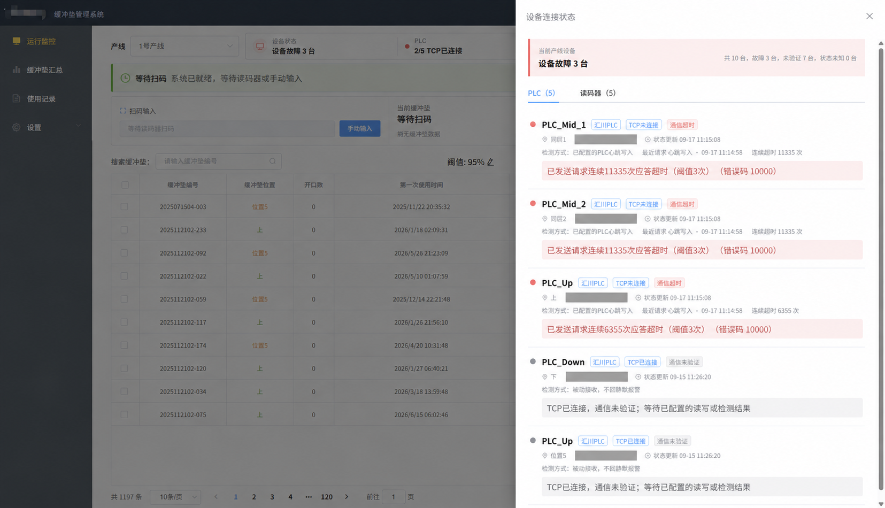
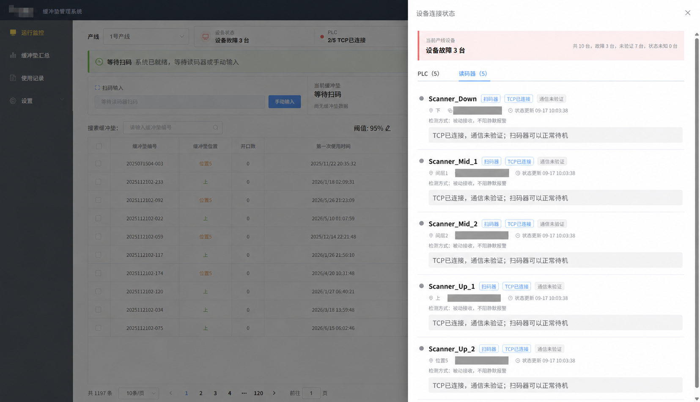

# BufferPad

[简体中文](README.md) · **English** · [All documentation](docs/README.en.md)

[](https://github.com/sapphirexai/bufferpad/actions/workflows/ci.yml)

**Industrial cushion lifecycle tracking with barcode scanning and PLC integration.**

BufferPad tracks the usage of reusable industrial cushions, handles duplicate scans, and reports lifetime thresholds to configured PLCs. This monorepo includes the web frontend, Java backend, and Windows deployment scripts. The development history was migrated from three repositories; see [migration notes](docs/migration-history.en.md).

## See the interface


The monitor brings device status, scan state, usage counts, and lifetime limits together. The device drawers distinguish TCP connectivity from verified protocol communication and show timeout details.

| PLC diagnostics | Barcode scanner status |
|---|---|
|  |  |

These maintainer-supplied screenshots show recorded states, not a live demo. Deployment addresses are covered and former company branding is removed in the public copies. A connected TCP socket does not prove successful PLC operations; passive scanners can wait without incoming data. See the [illustrated tour](docs/product-tour.en.md). The application interface is currently in Chinese; English documentation explains its labels and workflows.

## Capabilities

- TCP barcode input and manual scanning with configurable duplicate-scan handling.
- Cushion usage history, lifetime limits, search, and export.
- Communication adapters for Mitsubishi MC/SLMP, Inovance Modbus TCP, and Siemens S7. Individual device models and parameters require validation.
- Separate business and communication events, device diagnostics, and SSE updates.
- Administrator/user accounts, sessions, and operation auditing.
- Windows runtime preparation, service installation, and maintenance scripts.

The historical backend directory name is `wms-opc`; this project does **not** provide a general OPC UA server.

## Prerequisites

This is a **source repository**, not a ready-to-install offline bundle.

- Java 17 and Maven 3.8 or a compatible newer version.
- Node.js 18.19.0, the tested compatibility baseline for the legacy Vue 2 / Webpack 3 frontend. Runtime modernization is planned separately.
- MySQL 8.0.
- **HslCommunication Java 3.4.0**, obtained separately with appropriate authorization. Place the JAR at `wms-opc/src/main/resources/lib/HslCommunication-3.4.0.jar`; see [dependency notes](wms-opc/src/main/resources/lib/README.en.md).

Without HSL, the current backend cannot compile completely. HSL, runtime installers, application binaries, logs, and PDFs are not distributed in this repository. There is currently no hosted demo or hardware-free demo mode.

## Local setup (PowerShell)

Script validation uses PowerShell 7 (`pwsh`). Windows PowerShell 5.1 may misread BOM-less UTF-8 installer scripts; production installation under that runtime is not validated. The CI syntax checker handles UTF-8 explicitly, but does not execute the installer.

Clone the repository and run commands from its root:

```powershell
git clone https://github.com/sapphirexai/bufferpad.git
Set-Location bufferpad
mysql --default-character-set=utf8mb4 -u root -p
```

In the MySQL client, initialize a **new empty database**:

```sql
CREATE DATABASE wms_opc CHARACTER SET utf8mb4;
USE wms_opc;
SOURCE bufferpad-installer/app/db/wms_opc.sql;
```

Create an application database account and grant the appropriate permissions separately. Do not import initialization SQL over an existing deployment; review the [database upgrade instructions](bufferpad-installer/app/db/README.en.md).

After preparing the HSL JAR, build and start the backend:

```powershell
$env:BUFFERPAD_DB_USERNAME = 'bufferpad'
$env:BUFFERPAD_DB_PASSWORD = [System.Net.NetworkCredential]::new('', (Read-Host 'Database password' -AsSecureString)).Password
$env:BUFFERPAD_ADMIN_PASSWORD = [System.Net.NetworkCredential]::new('', (Read-Host 'Initial administrator password' -AsSecureString)).Password
powershell -ExecutionPolicy Bypass -File .\scripts\build-backend.ps1 -PublicRepositories
java -jar .\wms-opc\target\opc-0.0.1.-SNAPSHOT.jar --spring.profiles.active=dev
```

For an empty account table, the initial username defaults to `admin`. Choose your own password: 8–64 characters and at most 72 UTF-8 bytes. Existing accounts are not reset by this environment variable. Maintenance login is disabled unless the deployer explicitly sets `BUFFERPAD_MAINTENANCE_PASSWORD_HASH`; there is no shared maintenance password.

The default backend port is `9001`, with health status at `http://localhost:9001/actuator/health`. Set `BUFFERPAD_DB_URL` if the JDBC database address differs from the localhost example.

In a second terminal at the repository root:

```powershell
Set-Location bufferpad
npm ci --ignore-scripts --legacy-peer-deps --no-audit --no-fund
$env:NODE_OPTIONS = '--openssl-legacy-provider'
npm run dev
```

Open `http://localhost:8081` and sign in with your initialized account. The development server proxies `/api` to `http://localhost:9001`; use `BACKEND_URL` to override it. The OpenSSL option is for the legacy build tool, not application TLS. Skipping install scripts avoids old E2E browser downloads; it does not set up E2E testing.

For Windows packaging and service installation, see [build instructions](docs/build-and-package.en.md), the [installer guide](bufferpad-installer/README.en.md), and [runtime prerequisites](bufferpad-installer/packages/README.en.md). Test device settings and writes in isolation before connecting production equipment.

## Documentation

Use **English / 简体中文** at the top of any page to switch its language. The [complete documentation index](docs/README.en.md) includes setup, development, deployment, device configuration, database upgrades, and historical acceptance records.

| Topic | English documentation |
|---|---|
| Evaluate and run | [Tour](docs/product-tour.en.md) · [Getting started](docs/getting-started.en.md) |
| Develop and deploy | [Frontend](bufferpad/README.en.md) · [Backend](wms-opc/README.en.md) · [Windows installer](bufferpad-installer/README.en.md) |
| Configure equipment | [Device guide](bufferpad-installer/device-configuration.en.md) · [PLC tables](bufferpad-installer/plc-recommended-configuration.en.md) |
| Accounts and databases | [Authentication](wms-opc/docs/authentication.en.md) · [Database initialization](bufferpad-installer/app/db/README.en.md) · [Legacy upgrade](wms-opc/docs/sql/20260915-legacy-upgrade.en.md) |
| Contribute and maintain | [Contributing](CONTRIBUTING.en.md) · [CI](docs/ci.en.md) · [Maintenance](docs/maintaining.en.md) |

## Repository layout

| Directory | Purpose |
|---|---|
| `bufferpad/` | Vue 2 / Element UI frontend |
| `wms-opc/` | Java 17 / Spring Boot / MySQL backend |
| `bufferpad-installer/` | PowerShell, WinSW, and nginx deployment tooling; database SQL |
| `docs/` | Setup, illustrated tour, migration, and maintenance documentation |
| `scripts/` | Build prerequisites and repository checks |

## Tests and contributions

[CI](docs/ci.en.md) runs frontend unit tests/build, repository checks, and PowerShell syntax checks. **It does not compile the backend or run Java tests**, because HSL is not included. Complete backend validation must run locally with the required dependency. Neither protocol loopback tests nor CI prove physical PLC compatibility or successful production upgrades.

Bug reports and contributions are welcome in Chinese or English. Use the [issue forms](https://github.com/sapphirexai/bufferpad/issues/new/choose), read [CONTRIBUTING](CONTRIBUTING.en.md), and submit changes through a PR. All three required checks must pass for `main`; the single-maintainer workflow does not require a second approver.

See the [roadmap](ROADMAP.en.md), [changelog](CHANGELOG.md), and [releases](https://github.com/sapphirexai/bufferpad/releases). Report vulnerabilities through the [private reporting channel](https://github.com/sapphirexai/bufferpad/security/advisories/new), following [SECURITY.md](SECURITY.en.md).

## License

Project-owned code is licensed under [MIT](LICENSE). Third-party libraries, fonts, and runtimes retain their own terms; see [THIRD_PARTY_NOTICES](THIRD_PARTY_NOTICES.en.md). The MIT license grants no additional HSL download, use, or redistribution rights. Source previews contain no HSL or application binaries.
