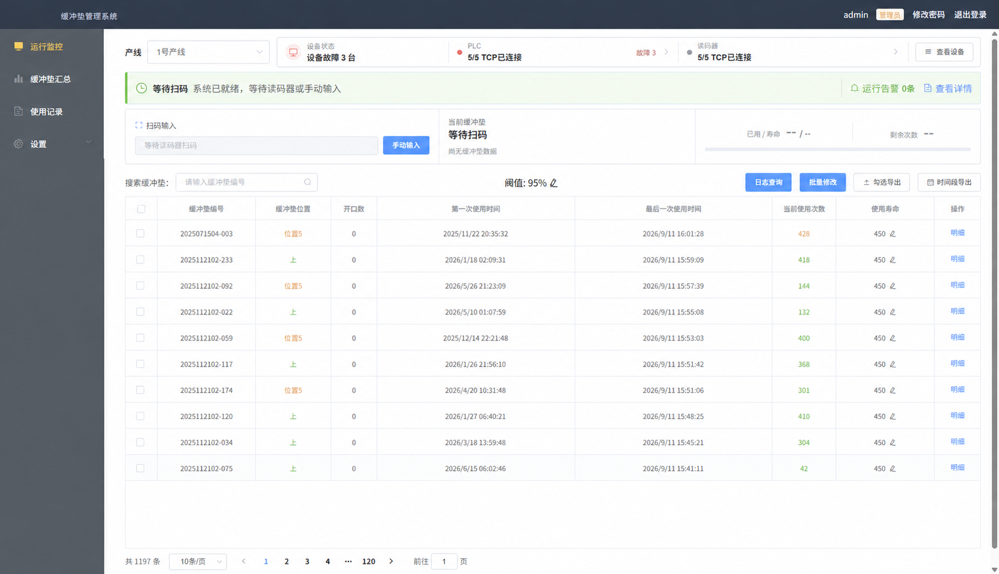

# BufferPad

**简体中文** · [English](README.en.md)

**面向制造现场的缓冲垫寿命追踪与 PLC 联动系统。**

BufferPad tracks reusable industrial cushion usage through barcode scans, prevents duplicate counting, and reports lifetime thresholds to PLCs. This repository contains the web frontend, Java backend, and Windows deployment scripts.

项目提供扫码计数、防重复计数、寿命预警、使用记录、运行事件和本地部署。它从三个内部 Git 仓库迁移而来，保留了开发历史；文件清理和历史编号变化见[迁移记录](docs/migration-history.md)。

## 界面预览

在一个页面查看产线连接状态、等待扫码提示、使用次数与寿命阈值。设备抽屉进一步区分 TCP 连接、通信验证和超时故障。

[查看三张截图与操作流程说明](docs/product-tour.md)。截图为维护者提供的界面记录，展示数据和设备状态不代表你的部署；公开副本中的现场地址已遮盖。

## 功能

| 能力 | 说明 |
|---|---|
| 扫码与计数 | 接收扫码器 TCP 数据，也支持手工扫码；按配置和业务规则处理重复扫描 |
| 寿命追踪 | 记录缓冲垫次数、明细和寿命阈值 |
| PLC 联动 | 代码包含三菱 MC/SLMP、汇川 Modbus TCP、西门子 S7 通信适配；具体型号和现场参数需实际验证 |
| 故障记录 | 分别记录业务处理和设备通信结果，提供运行事件及日志查询 |
| 实时展示 | Vue 管理界面和 SSE 更新，支持查询与导出 |
| 账户权限 | 管理员与普通用户、会话管理和操作审计 |
| Windows 部署 | 提供依赖准备、应用制品组装、服务安装和维护脚本 |

后端目录沿用历史名称 `wms-opc`，当前项目不提供通用 OPC UA 服务。真实 PLC 接入前请阅读[设备配置说明](bufferpad-installer/设备配置说明.md)。

## 开始使用

1. 克隆仓库，阅读[快速开始](docs/getting-started.md)。
2. 自行准备 **HslCommunication 3.4.0** 的适用授权及 JAR，放到[依赖说明](wms-opc/src/main/resources/lib/README.md)指定的位置。
3. 准备数据库和自己的初始管理员密码，按[构建与打包](docs/build-and-package.md)构建前后端。
4. 需要 Windows 离线部署时，再准备[运行时安装包](bufferpad-installer/packages/README.md)，生成本地安装目录。

**这是源码仓库。** 仓库及其公开历史不包含 HSL JAR、第三方安装包、前后端成品、运行日志和 PDF。没有准备 HSL JAR 时，当前后端不能完整编译；安装脚本也需要本地生成应用制品后才能安装。第三方依赖的获取与再分发受各自许可证约束。

## 目录

| 目录 | 内容 |
|---|---|
| [bufferpad](bufferpad/README.md) | Vue 2 / Element UI 前端 |
| [wms-opc](wms-opc/README.md) | Java 17 / Spring Boot / MySQL 后端 |
| [bufferpad-installer](bufferpad-installer/README.md) | PowerShell / WinSW / nginx 安装和维护脚本 |
| [docs](docs/getting-started.md) | 当前开源版本的构建、安装与迁移说明 |
| [scripts](scripts/build-backend.ps1) | 开源仓库构建辅助脚本 |

子项目中的历史验收、部署记录为工程沿革，已进行现场信息脱敏；其中示例地址与过去的账号策略不用于当前部署。当前配置以本页、快速开始和[登录与权限](wms-opc/docs/用户登录与权限.md)为准。

## 账户与配置

- 数据库连接使用 `BUFFERPAD_DB_URL`、`BUFFERPAD_DB_USERNAME`、`BUFFERPAD_DB_PASSWORD`。默认地址仅为本机示例，需要先建立数据库并授予账户适当权限。
- 空账户表初始化时，用户名默认 `admin`，必须通过 `BUFFERPAD_ADMIN_PASSWORD` 提供自己的密码。已有账户不会被初始化配置覆盖。
- `superadmin` 维护登录默认关闭。需要时由部署者提供自己的 `BUFFERPAD_MAINTENANCE_PASSWORD_HASH`；没有通用维护密码。更换哈希并重启后，旧维护会话失效。
- Windows 安装还需要 `BUFFERPAD_MYSQL_ROOT_PASSWORD`；安装脚本的默认数据库用户名为 `root`，此时 `BUFFERPAD_DB_PASSWORD` 必须与其 root 密码一致，也可以按安装说明配置独立应用账户。

## 测试与贡献

前端包含 Jest 单元测试；后端包含业务单元测试、H2 认证集成测试和本地协议回环测试。此次迁移的[验证结果](docs/migration-validation.md)记录了检查范围。回环测试不能代替真实设备验收。当前技术栈包含旧版依赖，版本升级应单独验证。

GitHub Actions 自动检查前端测试与构建、脚本语法及仓库文件；后端完整测试需要本地 HSL 依赖。[查看 CI 范围和复现命令](docs/ci.md)。

请在 Issue 中描述版本、复现步骤和脱敏日志，不上传数据库备份、实际凭据或现场设备连接信息。贡献流程见 [CONTRIBUTING.md](CONTRIBUTING.md)，安全问题见 [SECURITY.md](SECURITY.md)。

后续方向见[维护路线图](ROADMAP.md)，公开版本见[更新日志](CHANGELOG.md)和 [Releases](https://github.com/sapphirexai/bufferpad/releases)。维护者的 PR 与发布流程见[维护说明](docs/maintaining.md)。

## 许可证

本项目自有代码采用 [MIT License](LICENSE)。第三方库、字体和运行时依赖按各自条款使用，见 [THIRD_PARTY_NOTICES.md](THIRD_PARTY_NOTICES.md)。MIT 许可不授予 HslCommunication 或其他第三方组件的额外使用、下载或再分发权。
